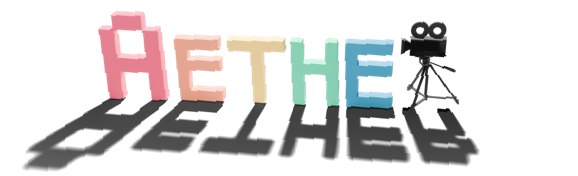

<div align="center">

# Aether: Geometric-Aware Unified World Modeling

</div>

<div align="center">
  
  <!-- <br> -->
</div>

<div align="center">
<a href=''></a> &nbsp;
<a href='https://aether-world.github.io'></a> &nbsp;
<a href=''></a> &nbsp;
</div>

Aether addresses a fundamental challenge in AI: integrating geometric reconstruction with generative modeling 
for human-like spatial reasoning. Our framework unifies three core capabilities: (1) **4D dynamic reconstruction**, 
(2) **action-conditioned video prediction**, and (3) **goal-conditioned visual planning**. Trained entirely on 
synthetic data, Aether achieves strong zero-shot generalization to real-world scenarios.

<div align="center">
    
</div>


## 📝 Citation
If you find this work useful in your research, please consider citing:

```bibtex
@article{aether,
    title={Aether: Geometric-Aware Unified World Modeling},
    author={Aether Team, Haoyi Zhu, Yifan Wang, Jianjun Zhou, Wenzheng Chang, Yang Zhou, Zizun Li, Junyi Chen, Chunhua Shen, Jiangmiao Pang, Tong He},
    year={2025},
    journal={arXiv preprint arXiv:placeholder}
}
```

## ⚖️ License
This repository is licensed under the MIT License - see the [LICENSE](LICENSE) file for details.

## 🙏 Acknowledgements
Our work is primarily built upon 
[Accelerate](https://github.com/huggingface/accelerate), 
[Diffusers](https://github.com/huggingface/diffusers), 
[CogVideoX](https://github.com/THUDM/CogVideo), 
[Finetrainers](https://github.com/a-r-r-o-w/finetrainers), 
[DepthAnyVideo](https://github.com/Nightmare-n/DepthAnyVideo), 
[CUT3R](https://github.com/CUT3R/CUT3R), 
[MonST3R](https://github.com/Junyi42/monst3r), 
[VBench](https://github.com/Vchitect/VBench),
[GST](https://github.com/SOTAMak1r/GST), 
[SPA](https://github.com/HaoyiZhu/SPA), 
[DroidCalib](https://github.com/boschresearch/DroidCalib),
[Grounded-SAM-2](https://github.com/IDEA-Research/Grounded-SAM-2),
[ceres-solver](https://github.com/ceres-solver/ceres-solver), etc.
We extend our gratitude to all these authors for their generously open-sourced code and their significant contributions to the community.
